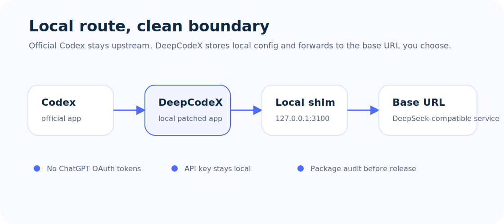
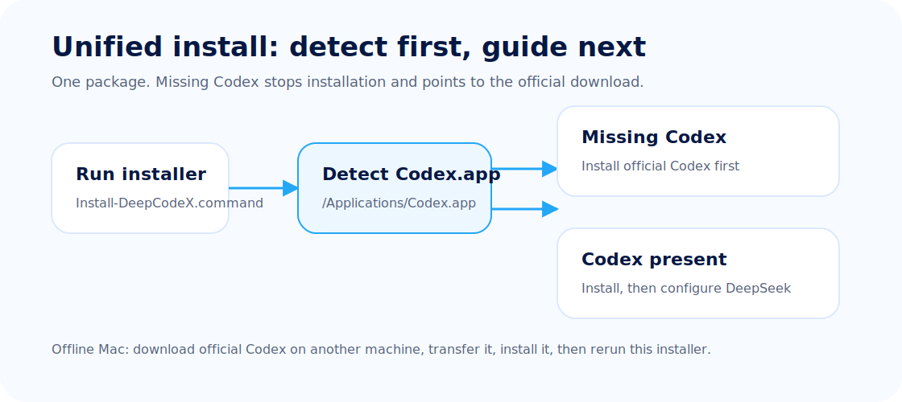
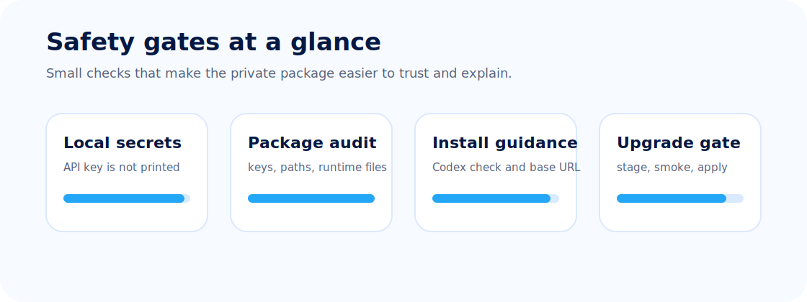

<p align="center">
  
</p>

# DeepCodeX

**Use [DeepSeek](https://deepseek.com) as the brain behind your local [Codex](https://openai.com/codex/) desktop app.**

中文文档：[README.zh-CN.md](README.zh-CN.md)

DeepCodeX patches your existing Codex desktop app so it talks to DeepSeek instead of OpenAI — entirely on your Mac, no cloud account swap needed. Bring your own DeepSeek API key and you're good to go.

> ### 🆕 New & kind of a big deal: your whole Codex past comes with you
>
> Switching tools used to feel like moving apartments and "forgetting" all your boxes at the old place — every conversation stranded back in vanilla Codex. **Not anymore.** DeepCodeX now imports **all** of your existing Codex history — conversations, archived threads, the session index, even the thread database — and keeps syncing new chats in the background, so you can pick up the 2 a.m. debugging spiral right where you left off. Nothing gets left at the door. → [Jump to it](#continuing-your-codex-projects)

> This is an unofficial community project. Not affiliated with OpenAI or DeepSeek.

## Quick Start

### Beginner path: no Terminal knowledge

1. Install the official Codex desktop app from https://openai.com/codex/.
2. Download this repository from GitHub as a source ZIP and unzip it.
3. Double-click `Install-DeepCodeX.command`.

The installer stops early if Codex is missing, opens the official Codex page, then asks only for your DeepSeek-compatible base URL and API key.

### Terminal path

You need three things: a Mac, the [official Codex app](https://openai.com/codex/), and a [DeepSeek API key](https://platform.deepseek.com).

> **Don't have Codex yet?** Grab it from [openai.com/codex](https://openai.com/codex/) first — DeepCodeX patches it but doesn't ship it. If your Codex lives somewhere other than `/Applications/Codex.app`, set `CODEX_APP=/your/path` before running the installer.

```bash
# 1. Make sure Codex.app is at /Applications/Codex.app

# 2. Clone and install
git clone https://github.com/KK-invent/DeepCodeX.git
cd DeepCodeX
scripts/install-local.sh

# 3. Plug in your DeepSeek key
~/.codex-deepseek/bin/deepcodex-configure-deepseek.py --restart-services

# 4. Build DeepCodeX from your local Codex
~/.codex-deepseek/bin/deepcodex-sync-upstream.py --stage    # dry run first
~/.codex-deepseek/bin/deepcodex-sync-upstream.py --apply    # build for real

# 5. Sanity check
~/.codex-deepseek/bin/deepcodex-doctor.py
```

The configure script will ask for a base URL — just press Enter to use the default (`https://api.deepseek.com`). If you're behind a corporate gateway or using another OpenAI-compatible endpoint, type that instead. Don't type `127.0.0.1:3100` — that's an internal address.

Once the app is running, you can change these settings anytime from the menu bar: **Configure DeepSeek...**

## How It Works



```
Codex app ──Responses API──▶ image shim (:3100) ──▶ bridge (:3000) ──▶ DeepSeek
```

Codex speaks OpenAI's Responses API. DeepSeek speaks Chat Completions. DeepCodeX bridges the two with a pair of lightweight Python services on localhost:

| Port | Service | What it does |
|------|---------|--------------|
| 3100 | **Image shim** | DeepSeek is text-only, so this strips image blocks (or converts them to text descriptions via a vision model) before forwarding |
| 3000 | **Bridge** | Translates Responses ↔ Chat Completions, swaps your local proxy key for your real DeepSeek API key, streams everything back |

Pure Python, no `pip install`, no Docker. They run as launchd services that start automatically on login.

### What's in the repo

| File | What it does |
|------|--------------|
| `bin/deepcodex-sync-upstream.py` | Copies your Codex.app → patches it for DeepSeek → signs → verifies |
| `bin/deepcodex-deepseek-bridge.py` | Responses ↔ Chat Completions translator (port 3000) |
| `bin/deepcodex-image-strip-proxy.py` | Strips/converts images so DeepSeek doesn't choke (port 3100) |
| `bin/deepcodex-configure-deepseek.py` | Sets your DeepSeek URL + API key (never prints secrets) |
| `bin/deepcodex-doctor.py` | Health check — tells you what's wrong and how to fix it |
| `bin/deepcodex-log-prune.py` | Keeps logs from eating your disk |
| `bin/deepcodex-backup.sh` | Backs up configs before changes |
| `bin/deepcodex-session-import.py` | Imports your regular Codex conversations so you can continue them in DeepCodeX ([docs](docs/SESSION_IMPORT.md)) |

### What's NOT in the repo

No Codex binaries, no `.app` builds, no API keys, no logs, no caches. This repo is the toolkit — you supply the Codex app and the DeepSeek key.



## Requirements

- macOS
- [Codex desktop app](https://openai.com/codex/) at `/Applications/Codex.app`
- [DeepSeek API key](https://platform.deepseek.com)
- Python 3.10+

<details>
<summary>Environment variables (most people won't need these)</summary>

```bash
export DEEPCODEX_HOME="$HOME/.codex-deepseek"
export CODEX_APP="/Applications/Codex.app"
export DEEPCODEX_APP="/Applications/Deepcodex.app"
export DEEPCODEX_LAUNCHD_DOMAIN="com.deepcodex"
```

</details>

## Continuing your Codex projects

DeepCodeX keeps its data in an isolated home (`~/.codex-deepseek`), so by default
it can't see the conversations from your regular Codex app (`~/.codex`). The
installer sets up a background sync (`com.deepcodex.session-sync`) that
automatically imports those conversations, archived threads, session index, and
thread database rows — and keeps importing new ones — so a project you started
in Codex shows up in DeepCodeX's history and can be picked up right where you
left off.

To import on demand (or preview first):

```bash
~/.codex-deepseek/bin/deepcodex-session-import.py --dry-run --include-history   # preview
~/.codex-deepseek/bin/deepcodex-session-import.py --include-history             # import
```

Details and options: [docs/SESSION_IMPORT.md](docs/SESSION_IMPORT.md).

## Updating

When Codex releases a new version, just re-run:

```bash
~/.codex-deepseek/bin/deepcodex-sync-upstream.py --stage
~/.codex-deepseek/bin/deepcodex-sync-upstream.py --apply
```

Or hit the update button inside the app — same thing.

## Safety



Everything runs locally. Your API key lives in `~/.codex-deepseek/secrets.env` (permissions `0600`) and only goes to DeepSeek's API. The patcher backs up your current app before every change and rolls back automatically if anything goes wrong.

Before pushing changes to this repo, run `scripts/audit-release.sh` — it catches leaked secrets, banned binaries, and broken docs.

## Compliance

This is a patcher, not a redistribution. No Codex binaries, OpenAI assets, or DeepSeek assets are included. Source code and original artwork are MIT-licensed; that doesn't cover upstream apps or trademarks. Details: [docs/COMPLIANCE.md](docs/COMPLIANCE.md).

## Contributing

Issues and PRs are welcome — just don't paste API keys or secrets into GitHub. See [CONTRIBUTING.md](CONTRIBUTING.md). Security issues: [SECURITY.md](SECURITY.md).

---

[CHANGELOG](CHANGELOG.md) · [VERSION](VERSION) · 中文安装: [docs/INSTALL.zh-CN.md](docs/INSTALL.zh-CN.md)
