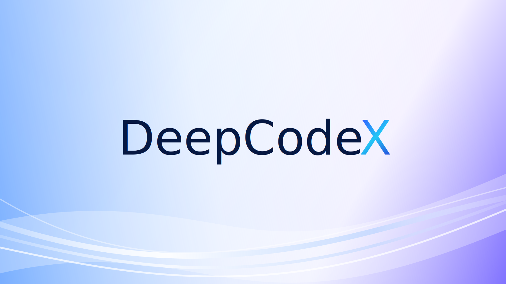
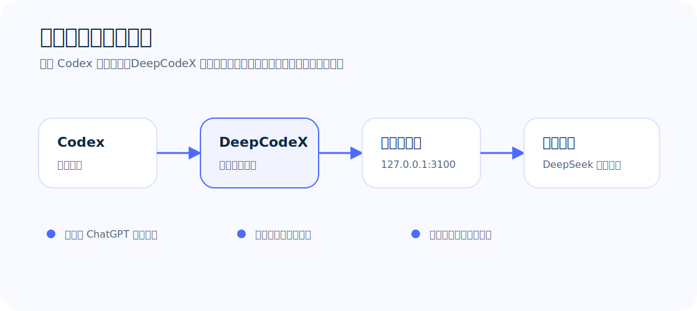
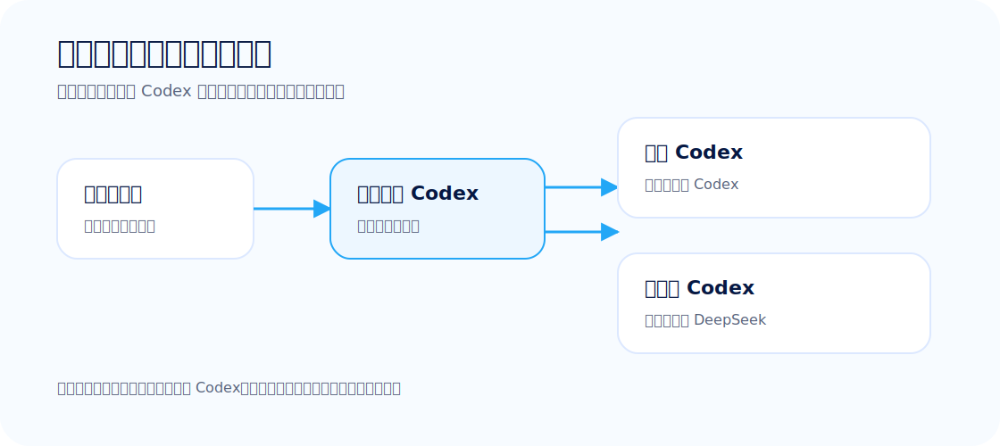
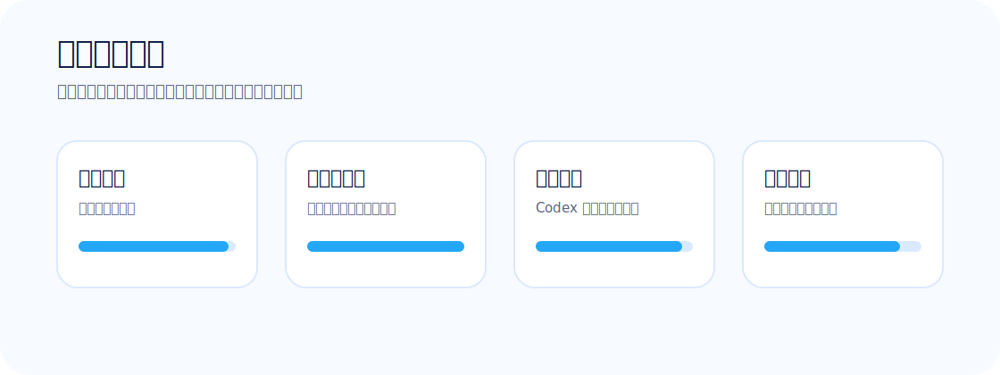

<p align="center">
  
</p>

# DeepCodeX

**让你的 [Codex](https://openai.com/codex/) 桌面应用跑在 [DeepSeek](https://deepseek.com) 上。**

DeepCodeX 给你已有的 Codex 桌面应用打个补丁，让它不走 OpenAI，改走 DeepSeek —— 全程在你自己的 Mac 上完成。只要有一个 DeepSeek API key 就能用。

> 非官方社区项目，与 OpenAI、DeepSeek 无关。

## 快速上手

你需要三样东西：一台 Mac、[官方 Codex 应用](https://openai.com/codex/)、一个 [DeepSeek API key](https://platform.deepseek.com)。

> **还没装 Codex？** 先从 [openai.com/codex](https://openai.com/codex/) 下载装好。DeepCodeX 只是给它打补丁，不自带 Codex。如果你的 Codex 不在默认路径，运行前 `export CODEX_APP=/你的路径` 就行。

```bash
# 1. 确保 Codex.app 在 /Applications/Codex.app

# 2. 克隆并安装
git clone https://github.com/KK-invent/DeepCodeX.git
cd DeepCodeX
scripts/install-local.sh

# 3. 填入你的 DeepSeek key
~/.codex-deepseek/bin/deepcodex-configure-deepseek.py --restart-services

# 4. 从本地 Codex 构建 DeepCodeX
~/.codex-deepseek/bin/deepcodex-sync-upstream.py --stage    # 先预检
~/.codex-deepseek/bin/deepcodex-sync-upstream.py --apply    # 正式构建

# 5. 检查一切是否正常
~/.codex-deepseek/bin/deepcodex-doctor.py
```

脚本会问你 base URL —— 大多数人直接回车用默认的 `https://api.deepseek.com` 就行。如果你走公司内网或第三方网关，填那个地址。别填 `127.0.0.1:3100`，那是内部用的。

装好后，随时可以在 DeepCodeX 菜单栏点 **「配置 DeepSeek...」** 改这些设置。

## 工作原理



```
Codex 应用 ──Responses API──▶ 剥图中转 (:3100) ──▶ 协议翻译 (:3000) ──▶ DeepSeek
```

Codex 说的是 OpenAI 的 Responses API，DeepSeek 说的是 Chat Completions API。DeepCodeX 在本地用两个轻量 Python 服务把它们接起来：

| 端口 | 服务 | 干什么的 |
|------|------|----------|
| 3100 | **剥图中转** | DeepSeek 是纯文本模型，图片会导致整轮失败。这层把图片剥掉（或用视觉模型转成文字描述），再转发给翻译层 |
| 3000 | **协议翻译** | Responses ↔ Chat Completions 双向翻译，把你的本地代理 key 换成真正的 DeepSeek API key，流式透传 |

纯 Python，不需要 pip install，不需要 Docker。装完后由 macOS launchd 开机自动拉起。

### 仓库里有什么

| 文件 | 用途 |
|------|------|
| `bin/deepcodex-sync-upstream.py` | 拷贝 Codex.app → 打 DeepSeek 补丁 → 签名 → 验证 |
| `bin/deepcodex-deepseek-bridge.py` | Responses ↔ Chat Completions 翻译器（端口 3000） |
| `bin/deepcodex-image-strip-proxy.py` | 剥图 / 图生文中转（端口 3100） |
| `bin/deepcodex-configure-deepseek.py` | 配置 DeepSeek 地址和 API key（不会打印密钥） |
| `bin/deepcodex-doctor.py` | 体检 —— 告诉你哪里不对、怎么修 |
| `bin/deepcodex-log-prune.py` | 日志清理，别让磁盘被 log 撑爆 |
| `bin/deepcodex-backup.sh` | 改配置前自动备份 |

### 仓库里没有什么

没有 Codex 二进制，没有 `.app` 成品，没有 API key，没有日志，没有缓存。这里只有工具；Codex 应用和 DeepSeek key 由你自己提供。



## 配置 DeepSeek

有三种方式，选一个你顺手的：

**命令行（首次推荐）**

```bash
~/.codex-deepseek/bin/deepcodex-configure-deepseek.py --restart-services
```

按提示填 base URL 和 API key 就行。key 通过密码输入，不会显示在屏幕上。

**应用内**

首次启动 DeepCodeX 会自动弹窗让你填。之后可以从菜单栏 **「配置 DeepSeek...」** 再次打开。

**直接编辑文件**

```bash
# ~/.codex-deepseek/secrets.env
DEEPSEEK_BASE_URL=https://api.deepseek.com
DEEPSEEK_API_KEY=sk-你的key
```

改完重启一下服务：`launchctl kickstart gui/$(id -u)/com.deepcodex.deepseek-bridge`

## 更新 Codex 版本

Codex 出新版了？重新跑一遍就行：

```bash
~/.codex-deepseek/bin/deepcodex-sync-upstream.py --stage
~/.codex-deepseek/bin/deepcodex-sync-upstream.py --apply
```

或者直接在应用里点更新按钮，效果一样。

## 安全



所有东西都在本地跑。你的 API key 存在 `~/.codex-deepseek/secrets.env`（权限 `0600`），除了发给 DeepSeek API 之外不会去别的地方。补丁器每次操作前都会备份，出问题自动回滚。

## 合规

这是一个补丁工具，不是重分发。仓库里不含 Codex 二进制、OpenAI 资产或 DeepSeek 资产。源码和原创素材使用 MIT 协议；不包含上游应用和商标的权利。详见 [docs/COMPLIANCE.md](docs/COMPLIANCE.md)。

## 参与贡献

欢迎提 Issue 和 PR —— 但别把 API key 或密钥贴到 GitHub 上。先看一眼 [CONTRIBUTING.md](CONTRIBUTING.md)。安全问题请走 [SECURITY.md](SECURITY.md)。

---

[更新记录](CHANGELOG.md) · [中文安装指南](docs/INSTALL.zh-CN.md) · [离线快速指南](docs/OFFLINE_QUICKSTART.zh-CN.md) · [排障指南](docs/TROUBLESHOOTING.zh-CN.md) · [隐私说明](docs/PRIVACY.zh-CN.md)
